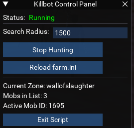
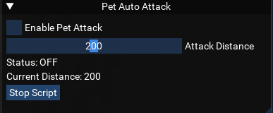
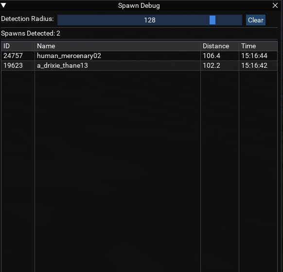
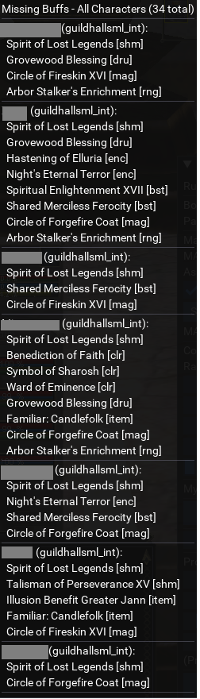

# EQstandalone

A collection of standalone Lua scripts for EverQuest that don't fit anywhere else.  These scripts are designed to work with MacroQuest and provide helpful automation and debugging utilities. 

## Scripts

### 🤖 Killbot (`killbot.lua`)

An automated mob farming script with a graphical user interface. Originally a macro by Rogue601, converted to Lua.



**Features:**
- Farms specific mobs defined in a configuration file (`farm.ini`)
- ImGui-based GUI control panel
- Configurable search radius
- Automatic navigation using MQ2Nav
- XTarget awareness for handling aggro
- Auto-stick and attack functionality

**Requirements:**
- MQ2Nav with valid mesh for the zone

**Usage:**
```
/lua run killbot
```

**Configuration:**

Create a `farm.ini` file in your MacroQuest `lua` directory with zone sections and mob names. Set the value to `1` to enable hunting that mob:

```ini
[eastwastes]
a_tundra_kodiak=1
a_dire_wolf=1
a_tundra_mammoth=1
```

**GUI Controls:**
- **Search Radius** - Set the detection range for mobs
- **Start Hunting** - Begin the farming loop
- **Stop Hunting** - Stop farming and clear targets
- **Reload farm.ini** - Reload the configuration without restarting
- **Exit Script** - Terminates the script

---

### 🐾 Sentry (`sentry.lua`)

An automated pet attack script with a graphical user interface. 



**Features:**
- Automatically commands your pet to attack the nearest NPC within a configurable range
- ImGui-based GUI for easy control
- Adjustable attack distance (0-400 units)
- Toggle on/off functionality
- 2-second attack interval to prevent spam

**Usage:**
```
/lua run sentry
```

**GUI Controls:**
- **Enable Pet Attack** - Toggle automatic pet attacks on/off
- **Attack Distance** - Slider to set the maximum distance for target detection
- **Stop Script** - Terminates the script

---

### 🔍 Spawn Debug (`spawndebug.lua`)

A debugging tool for monitoring NPC spawns within a configurable radius.



**Features:**
- Real-time spawn detection and logging
- Configurable detection radius (0-150 units)
- Displays spawn ID, name, distance, and timestamp
- Scrollable table view of all detected spawns
- Clear button to reset the spawn list

**Usage:**
```
/lua run spawndebug
```

**GUI Controls:**
- **Detection Radius** - Slider to adjust the monitoring range
- **Clear** - Clears the spawn list and resets tracking

---

### 📋 Missing Buff Monitor (`rdmissbuff.lua`)

A togglable GUI to display missing buffs across toons with multi-character support.



**Features:**
- Monitors missing buffs across all running characters
- Clickable GUI, click to select specific characters
- ImGui-based GUI with minimizable interface
- Shows character name, zone, and missing buffs
- Class-specific buff filtering (shows only relevant buffs for each class)
- Multi-character communication using Actors system
- Broadcasts buff status every 5 seconds
- Clickable character names to switch windows
- Auto-cleanup of offline characters (30 second timeout)
- Collapsible mini button for quick access

**Usage:**
```
/lua run rdmissbuff
```

**GUI Controls:**
- **Mini Button** - Click to toggle main window visibility
- **Character Names** - Click to bring that character's window to foreground
- **Main Window** - Shows all missing buffs organized by character

---

## Requirements

- [MacroQuest](https://www.macroquest.org/)
- Lua plugin enabled

## Installation

1. Download the desired `.lua` file(s)
2. Place them in your MacroQuest `lua` folder
3. Run in-game using `/lua run <scriptname>`

## License

Feel free to use and modify these scripts as needed.
